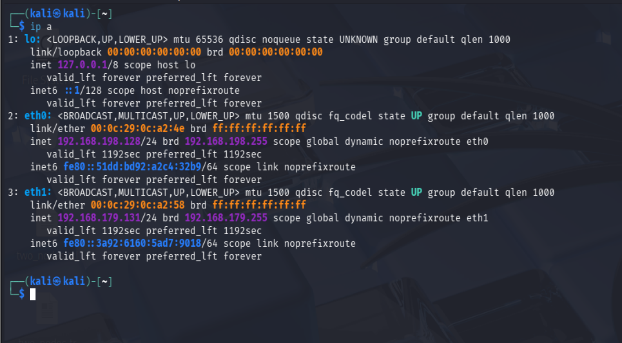
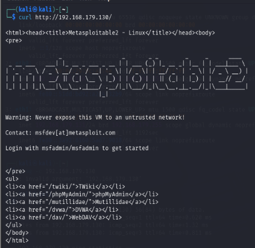
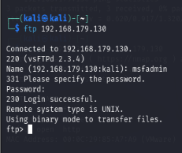
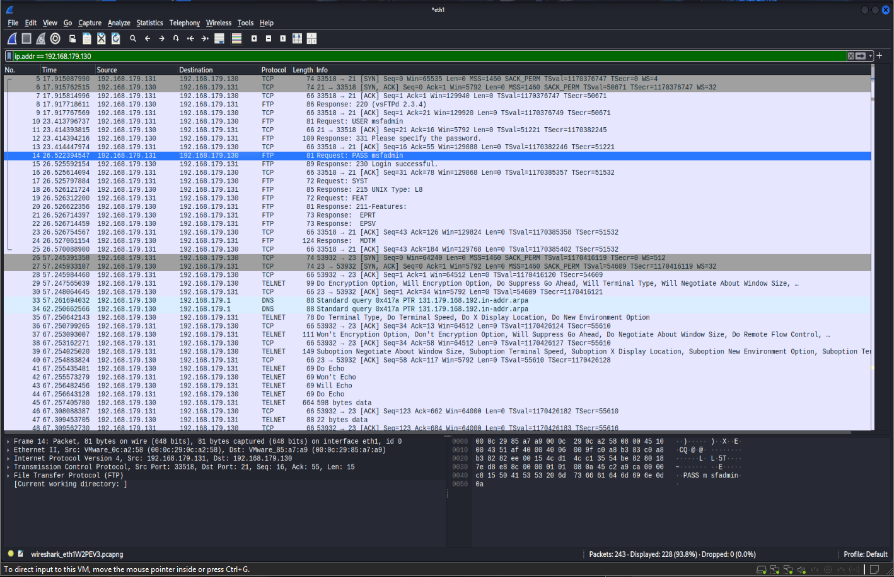

# Basic Network Traffic Analysis with Wireshark

Capturing and examining packets in a simulated lab network to detect cleartext credentials sent over insecure protocols (FTP, Telnet, HTTP).

> **Educational use only.** All testing was done on an isolated virtual lab that I own. Never capture traffic on networks you don't own or have permission to monitor.

## Aim

To capture and analyze network packets with Wireshark, and to show how credentials sent over unencrypted protocols can be read in plaintext by anyone who can sniff the traffic.

## Lab Setup

| Machine | Role | IP address | Interface |
|---|---|---|---|
| Kali Linux (VM) | Analyst / attacker machine, runs Wireshark | 192.168.179.131 | eth1 |
| Metasploitable 2 (VM) | Intentionally vulnerable target | 192.168.179.130 | n/a |

- Virtualization: VMware
- Kali also has `eth0` (192.168.198.128) on a separate NAT network. Capturing on `eth0` shows only background traffic (ARP, NTP, SSDP), so **the capture must be done on `eth1`**, which shares a subnet with the target.

## Where do the username and password come from?

Metasploitable 2 ships with **publicly documented default credentials**: username `msfadmin`, password `msfadmin`. The VM is deliberately insecure and made for practice. Its login screen and the official Metasploitable 2 documentation both list these defaults. They are not stolen or guessed credentials, and they only work on this practice VM.

## Tools Used

- Wireshark
- Kali Linux tools: `ip`, `ping`, `nmap`, `curl`, `ftp`, `telnet`

## Procedure

### 1. Check the lab network

Confirm Kali's interfaces and that `eth1` is on the same subnet as the target.

```bash
ip a
```


*Fig 1: Kali interfaces. eth1 = 192.168.179.131*

### 2. Verify connectivity and open services

```bash
ping -c 3 192.168.179.130
nmap -p 21,23,80 192.168.179.130
```


*Fig 2: Target reachable; ports 21 (FTP), 23 (Telnet) and 80 (HTTP) are open*

### 3. Start the Wireshark capture

Open Wireshark on Kali and start capturing on **eth1** before generating any traffic.

### 4. Generate lab traffic

Run these from Kali while Wireshark is capturing:

```bash
# HTTP GET
curl http://192.168.179.130/

# FTP login  (msfadmin / msfadmin)
ftp 192.168.179.130

# Telnet login  (msfadmin / msfadmin)
telnet 192.168.179.130
```

HTTP GET with `curl`:


*Fig 3a: HTTP GET request to the target web server*

FTP login:


*Fig 3b: FTP login to Metasploitable with `msfadmin` / `msfadmin`*

Telnet login to the target succeeded:


*Fig 4: Successful Telnet login to Metasploitable*

### 5. Find plaintext credentials in Wireshark

Display filter used for FTP:

```
ftp.request.command == "USER" || ftp.request.command == "PASS"
```


*Fig 5: FTP `USER` and `PASS` packets showing `msfadmin` in plaintext*

Other filters used in this lab:

| Purpose | Filter |
|---|---|
| All traffic to/from target | `ip.addr == 192.168.179.130` |
| FTP commands / credentials | `ftp.request.command == "USER" \|\| ftp.request.command == "PASS"` |
| Telnet sessions | `telnet` |
| HTTP traffic | `http` |
| HTTP Basic auth header | `http.authorization` |

### 6. Save the capture

Wireshark: **File → Save As → `lab_capture.pcap`**

## Observations

- Target IP: 192.168.179.130, analyst machine: 192.168.179.131 (eth1)
- FTP credentials were visible in plaintext in the `USER` and `PASS` packets: `msfadmin` / `msfadmin`
- Telnet login to the target succeeded using the same credentials, and Telnet sends the session unencrypted
- Capturing on the wrong interface (`eth0`) showed only unrelated ARP/NTP/SSDP traffic

## Result

Traffic between Kali and the Metasploitable target was captured in Wireshark, and FTP credentials were read in plaintext using a display filter.

## Conclusion

FTP, Telnet and HTTP send data, including usernames and passwords, without encryption, so anyone able to capture the traffic can read it. Encrypted alternatives should be used instead: **SFTP/FTPS** for FTP, **SSH** for Telnet, and **HTTPS** for HTTP. Packet analysis also helps analysts spot insecure protocols on a network.

## Repository Structure

```
.
├── README.md
├── lab_capture.pcap        # saved Wireshark capture (optional)
└── screenshots/
    ├── 01-ip-a.png
    ├── 02-ping-nmap.png
    ├── 03a-curl.png
    ├── 03b-ftp.png
    ├── 04-telnet-login.png
    └── 05-wireshark-ftp.png
```

## Author

Mahaal, B.Tech CSE (Cybersecurity), MIET Jammu
GitHub: [mahaaldalpatia](https://github.com/mahaaldalpatia)
